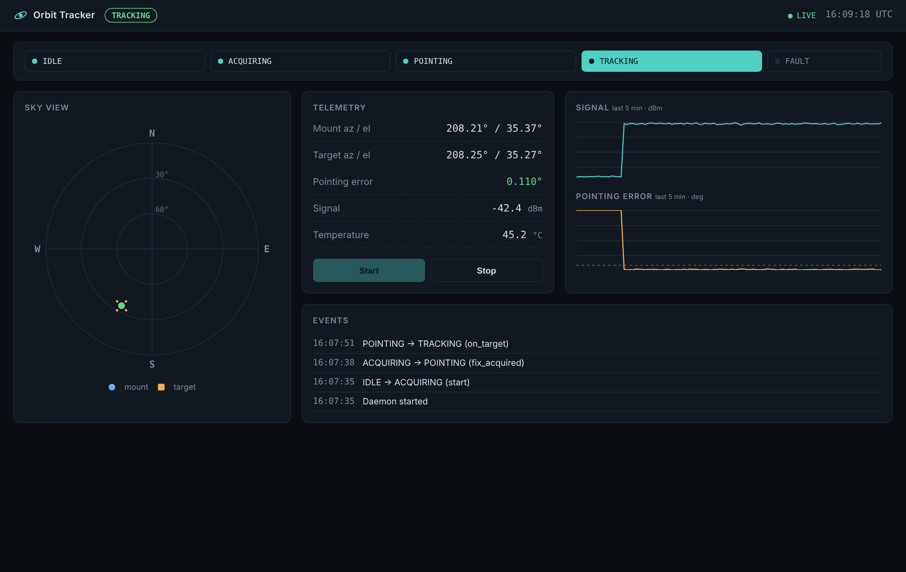

# Orbit Tracker 🛰️

**[Français](#français) · [English](#english)**



---

## Français

Un petit système de contrôle pour une monture de poursuite à deux axes : un **démon superviseur** qui possède le matériel, une **API REST** qui n'y touche jamais directement et un **tableau de bord en direct** pour l'opérateur. La monture et les capteurs sont simulés, donc tout fonctionne sur un portable avec une seule commande.

### Lancer

```bash
python3 run.py
```

Ouvrez http://localhost:8000. La monture obtient une position, pivote vers la cible et s'y verrouille. Python 3.10+, aucune dépendance à installer.

Lancez les tests avec `python3 -m unittest`.

### Architecture

```
┌──────────────┐  state.json (atomic write, 10 Hz)  ┌─────────────┐  JSON over HTTP  ┌───────────┐
│    Daemon    │ ─────────────────────────────────▶ │     API     │ ───────────────▶ │ Dashboard │
│ control loop │ ◀───────────────────────────────── │  + history  │ ◀─────────────── │  (Vue 3)  │
└──────────────┘        command.json (drop-in)      └─────────────┘   POST command   └───────────┘
```

- **Une seule autorité.** Seul le démon fait bouger la monture. L'API publie ce que le démon rapporte et transmet les commandes de l'opérateur sous forme de fichiers; si l'API plante, la poursuite continue.
- **Passage atomique.** Les instantanés et les commandes sont écrits dans un fichier temporaire puis renommés, donc un lecteur ne voit jamais un fichier à moitié écrit.
- **Cœur testable.** La machine à états est une table de transitions pure, sans E/S.

#### Machine à états

```
IDLE ──start──▶ ACQUIRING ──fix──▶ POINTING ──on target──▶ TRACKING
  ▲                                    ▲                       │
  └────────────── stop ────────────────┴───── off target ──────┘
                 any active state ──fault──▶ FAULT ──reset──▶ IDLE
```

Le verrouillage utilise une hystérésis (entrée sous 0,4°, sortie au-dessus de 1,2°) pour que l'état ne clignote pas à la limite. De temps en temps, une perturbation aléatoire fait sortir la monture de la cible pour montrer la réacquisition.

#### Simulation

- La cible dérive le long d'un lent huit
- La monture pivote à vitesse plafonnée, toujours par le chemin le plus court en azimut, avec un peu de gigue d'asservissement
- Le signal suit un modèle de faisceau gaussien : fort sur la cible, il diminue avec l'erreur de pointage
- La température du boîtier tend vers un équilibre qui dépend du fonctionnement des moteurs

Remplacez `tracker/simulation.py` par de vrais pilotes et rien d'autre n'a besoin de changer.

### Structure

```
tracker/   démon, machine à états, simulation
api/       serveur HTTP (stdlib) : /api/status, /api/history, /api/command
web/       tableau de bord : vue du ciel, télémétrie, graphiques, journal d'événements
tests/     tests de la machine à états et de la géométrie
```

### API

| Méthode | Chemin | |
|---|---|---|
| GET | `/api/status` | Dernier instantané du démon |
| GET | `/api/history` | 5 dernières minutes de signal, d'erreur et de température |
| POST | `/api/command` | `{"action": "start" \| "stop" \| "reset"}` |

---

## English

A small control system for a two-axis tracking mount: a **supervisor daemon** that owns the hardware, a **REST API** that never touches it directly, and a **live dashboard** for the operator. The mount and sensors are simulated, so the whole thing runs on a laptop with one command.

### Run it

```bash
python3 run.py
```

Open http://localhost:8000. The mount acquires a fix, slews to the target and locks on. Python 3.10+, no dependencies to install.

Run the tests with `python3 -m unittest`.

### Architecture

```
┌──────────────┐  state.json (atomic write, 10 Hz)  ┌─────────────┐  JSON over HTTP  ┌───────────┐
│    Daemon    │ ─────────────────────────────────▶ │     API     │ ───────────────▶ │ Dashboard │
│ control loop │ ◀───────────────────────────────── │  + history  │ ◀─────────────── │  (Vue 3)  │
└──────────────┘        command.json (drop-in)      └─────────────┘   POST command   └───────────┘
```

- **One authority.** Only the daemon moves the mount. The API publishes what the daemon reports and forwards operator commands as files; if the API crashes, tracking continues.
- **Atomic hand-off.** Snapshots and commands are written to a temp file and renamed, so a reader never sees half a file.
- **Testable core.** The state machine is a pure transition table with no I/O.

#### State machine

```
IDLE ──start──▶ ACQUIRING ──fix──▶ POINTING ──on target──▶ TRACKING
  ▲                                    ▲                       │
  └────────────── stop ────────────────┴───── off target ──────┘
                 any active state ──fault──▶ FAULT ──reset──▶ IDLE
```

Lock uses hysteresis (enter below 0.4°, drop above 1.2°) so the state doesn't flicker at the edge. A random disturbance now and then knocks the mount off target to show re-acquisition.

#### Simulation

- Target drifts along a slow figure-eight
- Mount slews at a capped rate, always the short way around in azimuth, with a bit of servo jitter
- Signal follows a Gaussian beam model: strong when on target, falling off with pointing error
- Enclosure temperature settles toward an equilibrium that depends on whether the motors are running

Swap `tracker/simulation.py` for real drivers and nothing else needs to change.

### Layout

```
tracker/   daemon, state machine, simulation
api/       HTTP server (stdlib): /api/status, /api/history, /api/command
web/       dashboard: sky view, telemetry, charts, event log
tests/     state machine and geometry tests
```

### API

| Method | Path | |
|---|---|---|
| GET | `/api/status` | Latest snapshot from the daemon |
| GET | `/api/history` | Last 5 minutes of signal, error and temperature |
| POST | `/api/command` | `{"action": "start" \| "stop" \| "reset"}` |

---
Katherine Liberona Irarrázabal · [github.com/katherinemli](https://github.com/katherinemli)
